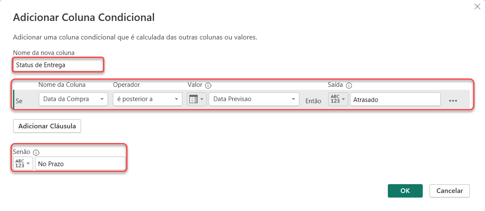
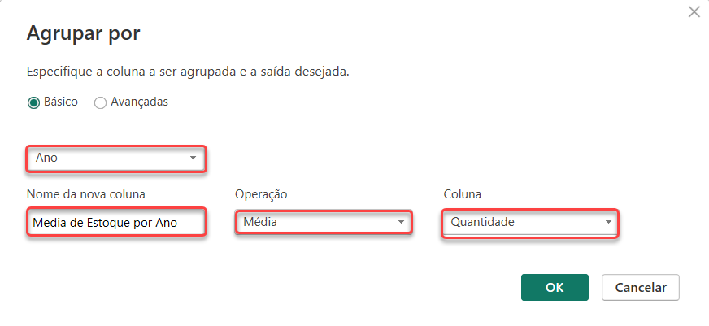
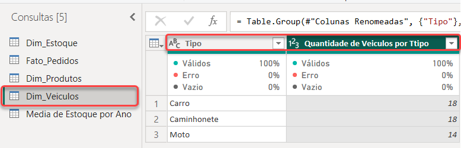
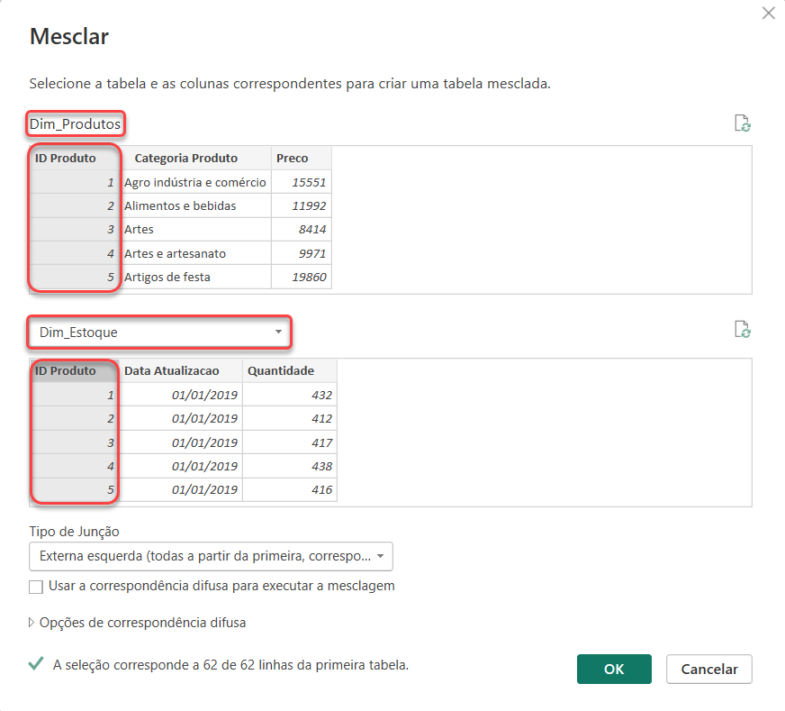
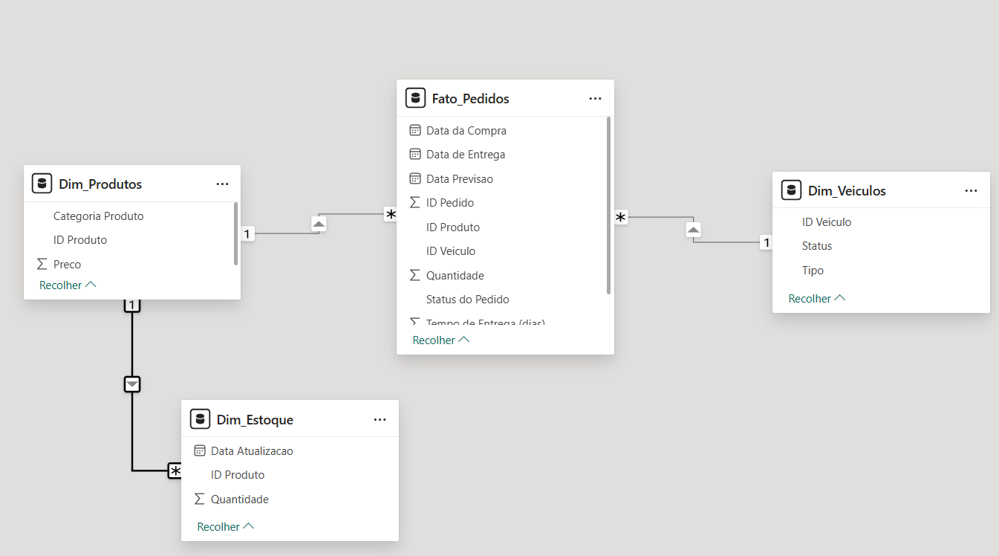

# Power Query Notes

## Hermex Database Overview

The initial data is stored in an Excel workbook (`.xlsx`) containing four distinct sheets. To follow database best practices, these tables were identified as either Fact (`Fato_`) or Dimension (`Dim_`) components.

### Tables Structure

#### 1. Products (Dim_Produtos)
Contains details about the products handled by the logistics company.

| Column | Data Type / Description |
| :--- | :--- |
| id_produto | Product unique identifier |
| categoria_produto | Product category |
| preço | Unit price |

#### 2. Inventory (Dim_Estoque)
Tracks current product availability in stock.

| Column | Data Type / Description |
| :--- | :--- |
| ID Produto | Product unique identifier |
| Data atualização | Timestamp of the last update |
| Quantidade | Stock quantity available |

#### 3. Vehicles (Dim_Veículos)
Lists the fleet available for logistics operations.

| Column | Data Type / Description |
| :--- | :--- |
| ID veículos | Vehicle unique identifier |
| Tipo | Vehicle type (e.g., Car, Truck, Motorcycle) |
| Status | Current availability (e.g., Occupied, Available) |

#### 4. Orders (Fato_Pedidos)
The core transactional table containing order and delivery details.

| Column | Data Type / Description |
| :--- | :--- |
| ID Pedido | Order unique identifier |
| ID Produto | Product identifier |
| Quantidade | Quantity ordered |
| ID Veículo | Vehicle assigned to the delivery |
| Status do pedido | Delivery status (e.g., Delivered, In transit) |
| Data da compra | Purchase date |
| Data de entrega | Actual delivery date |
| Data previsão | Estimated delivery date |
| UF | State abbreviation code |
| ESTADO | Full state name |

---

## Step-by-Step Data Transformation (Data Cleaning)

### 1. Data Import
1. Open **Power BI Desktop**.
2. In the top ribbon, click **Get Data** > **Excel workbook**.
3. Select the `base-de-dados-hermex.xlsx` file and click **Open**.
4. In the Navigator window, check the boxes for **Pedidos**, **Estoque**, **Veículos**, and **Produtos**.
5. Click **Transform Data** to launch the Power Query Editor.
6. *Best Practice Realignment:* Renamed the tables to `Fato_Pedidos`, `Dim_Estoque`, `Dim_Veículos`, and `Dim_Produtos` to visually structure the upcoming data model.

### 2. Removing Unnecessary Columns

| Query (Table) | Action Taken | Reason |
| :--- | :--- | :--- |
| **Dim_Produtos** | Removed `Column4` | Contained only null values. |
| **Fato_Pedidos** | Removed `Estados` | Contained only null values. |
| **Dim_Veículos** | Selected essential columns and applied **Remove Other Columns** | Kept only relevant columns, discarding multiple null columns at once. |

### 3. Handling Empty and Null Values

To ensure data quality across the dataset, the following validation steps were applied:

1. Enabled **Column Quality** under the **View** tab to check the percentage of valid, empty, and error values.
2. Switched the data profiling setting in the bottom-left status bar from *"Column profiling based on top 1000 rows"* to ***"Column profiling based on entire dataset"*** for complete accuracy.
3. Inspected the ID columns for **Dim_Estoque**, **Dim_Produtos**, and **Dim_Veículos**.
4. Filtered out blank rows by clicking the column header dropdown and selecting **Remove Empty**.

### 4. Advanced Value Replacement (Delivery Dates)

The `Data de entrega` (Delivery Date) column in the **Fato_Pedidos** table contained the text `"Não disponível"` for orders still in transit. Since these rows represent active orders, they could not be deleted. 

To convert the column type correctly later without generating errors, the text was replaced with blank values:

1. Right-clicked a cell containing `"Não disponível"` and selected **Replace Values...**.
2. Left the **Replace With** field completely empty.
3. Clicked **OK** to turn the text strings into standard blank values (`null`), preparing the column for proper date formatting.

> Data transformation is an iterative process. It may be necessary to return to Power Query to refine these steps as the analysis progresses.

---

### 5. Adding Calculated Columns (M Language)

#### Objective
The company needs to analyze delivery efficiency but lacks a clear metric for the total time elapsed between the purchase and the actual delivery. The goal is to create a custom column calculating the delivery time in days to identify delays and improve operational efficiency.

#### Step-by-Step Implementation

1. In the **Fato_Pedidos** table, navigate to the **Add Column** tab in the top ribbon and select **Custom Column**.
2. In the Custom Column window, configure the following settings:

| Field | Value / Formula |
| :--- | :--- |
| **New column name** | `Tempo de Entrega (dias)` |
| **Custom column formula** | `Duration.Days([Data de Entrega] - [Data da Compra])` |

3. Click **OK** to generate the column.
4. Change the data type of this newly created column to **Whole Number**.

---

#### Technical Breakdown

The formula utilizes Power Query's **M Language** duration functions:

Duration.Days([Data de Entrega] - [Data da Compra])

* **`[Data de Entrega] - [Data da Compra]`**: Subtracts the purchase date from the delivery date, resulting in a standard `Duration` data type (represented as days.hours:minutes:seconds).
* **`Duration.Days()`**: Extracts strictly the total number of full days from that duration result, turning it into a clean integer for performance optimization and easier calculations.

---

### 6. Verification of Delivery Delays

#### Objective
The company needs to quickly identify which orders are delayed to take corrective actions, such as notifying customers or reallocating logistics resources. The goal is to create a conditional column that compares the actual delivery date with the estimated forecast date to flag the shipping status for management reports.

#### Step-by-Step Implementation

1. In the **Fato_Pedidos** table, navigate to the **Add Column** tab in the top ribbon and select **Conditional Column**.
2. Configure the logic using the parameters below:

3. Click **OK** to generate the column and set its data type to **Text**.

---

#### Technical Breakdown (M Language)

Behind the graphical interface, Power Query executes a conditional statement that accounts for active orders (where the delivery date is missing/null):

Table.AddColumn(#"Personalização Adicionada", "Status de Entrega", each if [Data de Entrega] = null then null else if [Data de Entrega] > [Data Previsao] then "Atrasado" else "No Prazo")

* **Handling Nulls:** Checking for `null` first prevents active orders in transit from being incorrectly flagged as "No Prazo" (On Time) or causing evaluation errors.

---

### 7. Table Grouping and Aggregations

#### Objective
The company wants to monitor the average inventory level per year and vehicle availability to optimize resources and reduce costs. The goal is to create two separated queries for logistic planning:
1. **Average Inventory per Year**
2. **Vehicle Count by Type and Status**

---

#### Part 1: Average Inventory per Year

##### Step-by-Step Implementation

1. To preserve the original dataset, right-click the **Dim_Estoque** query in the left pane and select **Duplicate**. Rename the new query to `Media de Estoque por Ano`.
2. In this new query, select the `Data atualização` column.
3. Navigate to the **Add Column** tab, click **Date** > **Year** > **Year**. This extracts the year into a new column named `Ano`.
4. Go to the **Transform** tab and click **Group By**.
5. Configure the Group By window using **Advanced** mode:

6. Click **OK** to generate the aggregated table.

---

#### Part 2: Vehicle Count by Type and Status

##### Step-by-Step Implementation

1. Right-click the **Dim_Veículos** query in the left pane and select **Duplicate**. Rename the new query to `Quantidade de Veiculos por Tipo`.
2. Go to the **Transform** tab and click **Group By**.
3. Select **Advanced** mode to group by multiple criteria simultaneously:

4. Click **OK**. The resulting table will display the total volume of vehicles categorized by their type (e.g., Car, Truck, Motorcycle) and operational status (e.g., Occupied, Available).

---

#### Summary of Created Queries

| Query Name | Granularity / Rows | Key Metric Provided |
| :--- | :--- | :--- |
| `Media de Estoque por Ano` | One row per Year | Average items in stock |
| `Quantidade de Veiculos por Tipo` | One row per Type + Status combination | Total fleet distribution |

---

### 8. Merging Queries with Conditional Filtering

#### Objective
The company needs to analyze high-value product performance and the operational cost impact of motorcycle deliveries. The goal is to create two new separate consolidated queries for strategic analysis:
1. **ProdutoEstoque:** Merging products and inventory, keeping only high-value items (Price > 100).
2. **PedidosVeiculos:** Merging orders and vehicles, keeping only deliveries made by motorcycles.

---

#### Part 1: High-Value Products Inventory (Dim_Produtos + Dim_Estoque)

##### Step-by-Step Implementation

1. Select the **Dim_Produtos** query.
2. In the **Home** tab, click the dropdown next to *Merge Queries* and select **Merge Queries as New**.
3. Configure the merge operation:
   * **Primary Table:** `Dim_Produtos` (Select `id_produto`)
   * **Secondary Table:** `Dim_Estoque` (Select `ID Produto`)
   * **Join Kind:** Left Outer (Default)
4. Rename the newly generated query to `ProdutoEstoque`.
5. Click the **Expand** icon on the right side of the `Dim_Estoque` column header:
   * Select only `Data atualização` and `Quantidade`.
   * Uncheck *"Use original column name as prefix"*.
6. Click the filter dropdown on the `preço` column header, select **Number Filters** > **Greater Than...**, and input `100`.

---

#### Part 2: Motorcycle Deliveries Analysis (Fato_Pedidos + Dim_Veículos)

##### Step-by-Step Implementation

1. Select the **Fato_Pedidos** query.
2. In the **Home** tab, click the dropdown next to *Merge Queries* and select **Merge Queries as New**.
3. Configure the merge operation:
   * **Primary Table:** `Fato_Pedidos` (Select `ID Veículo`)
   * **Secondary Table:** `Dim_Veículos` (Select `ID veículos`)
   * **Join Kind:** Left Outer (Default)
4. Rename the newly generated query to `PedidosVeiculos`.
5. Click the **Expand** icon on the right side of the `Dim_Veículos` column header:
   * Select only `Tipo` and `Status`.
   * Uncheck *"Use original column name as prefix"*.
6. Click the filter dropdown on the expanded `Tipo` column header, and check only **Moto**.

---

#### Summary of Strategic Queries

| New Query Name | Base Tables Combined | Core Filter Applied |
| :--- | :--- | :--- |
| `ProdutoEstoque` | `Dim_Produtos` + `Dim_Estoque` | `preço > 100` |
| `PedidosVeiculos` | `Fato_Pedidos` + `Dim_Veículos` | `Tipo = "Moto"` |

---

### 9. Centralizing Source Paths with Parameters

#### Objective
The company maintains datasets across different directories, creating maintenance and portability challenges. The goal is to create a dynamic parameter to centralize the root directory path. This ensures that changing the folder location updates all queries simultaneously, reducing manual errors.

#### Step-by-Step Implementation

1. In the **Home** tab of Power Query, click **Manage Parameters** > **New Parameter**.
2. Configure the parameter details:

| Property | Value |
| :--- | :--- |
| **Name** | `DiretorioBase` |
| **Type** | Text |
| **Current Value** | *The local folder path where your dataset is stored* (e.g., `C:\YourFolder\`) |

> **Note:** Always include a trailing slash (`\`) at the end of the directory path string so it seamlessly combines with the file name.

3. Select any imported query (e.g., *Fato_Pedidos*) and open the **Source** step inside the Advanced Editor or Formula Bar.
4. Replace the static, hardcoded file path string with the parameter code structure:

`File.Contents(DiretorioBase & "base-de-dados-hermex.xlsx")`

5. Repeat this change for the **Source** step of all queries pointing to this database.

---

#### Technical Breakdown

By replacing a hardcoded path with a parameter, Power Query shifts from a static reference to a dynamic one:

* **`DiretorioBase`**: Acts as a variable holding the root folder location text.
* **`&` Operator**: Concatenates (joins) the folder path text with the specific filename string.

This approach ensures project portability—if the file moves to another computer or server, you only need to update the parameter value once to fix all query connections.

---

### 10. Documenting Transformations inside Power Query

#### Objective
As data teams expand, ensuring that all data transformation steps are transparent, clear, and replicable is critical. The goal is to add internal documentation and descriptions directly to complex steps within the Power Query interface (such as calculated columns, merges, and parameters), making the project self-explanatory and easy to maintain.

#### Step-by-Step Implementation

1. In the **Applied Steps** pane on the right side of the editor, identify the key transformation step you want to document.
2. Right-click the step and select **Properties**.
3. In the Description box, write a concise explanation of what that step accomplishes and why it was created.
4. Click **OK**. A small info icon `(i)` will appear next to the step name, allowing anyone to hover over it and read your notes.

---

#### Recommended Documentation Blueprint

Here are the critical steps from this journey that should receive internal descriptions:

| Query / Table | Step Name | Recommended Internal Description (PT) |
| :--- | :--- | :--- |
| **Fato_Pedidos** | `Personalização Adicionada` | "Calcula o tempo de entrega em dias corridos utilizando a função Duration.Days baseada na subtração entre a Data de Entrega e a Data da Compra." |
| **Fato_Pedidos** | `Coluna Condicional Adicionada` | "Cria o Status de Entrega (Atrasado / No Prazo), tratando valores nulos primeiro para garantir que pedidos em trânsito não gerem erros na análise." |
| **ProdutoEstoque** | `Fonte` / `Consultas Mescladas` | "Junção entre as tabelas de Produtos e Estoque (Left Outer Join) filtrando apenas itens com preço unitário superior a 100 para análise de alta relevância." |
| **PedidosVeiculos** | `Linhas Filtradas` | "Filtro aplicado após a mesclagem para reter exclusivamente os registros de entregas efetuadas pelo tipo de veículo 'Moto'." |

---

### 11. Data Loading Optimization and Data Modeling (Relationships)

#### Objective
After completing all transformations, the data must be properly loaded and modeled within Power BI. The goal is to optimize performance by preventing intermediate analytical queries from loading into memory, and establish the correct relationships (cardinality) between Fact and Dimension tables.

#### Step-by-Step Implementation

##### Part 1: Optimizing the Data Load (Disable Load)
To keep the model lightweight, tables used purely for intermediate analysis or merging do not need to be loaded into the front-end memory.

1. In the left pane of Power Query, right-click the following queries: `Media de Estoque por Ano`, `Quantidade de Veiculos por Tipo`, `ProdutoEstoque`, and `PedidosVeiculos`.
2. Uncheck **Habilitar carga** (Enable Load). 
3. Notice that the query names change to *italics*, confirming they will process in the background but won't bloat the final dashboard file size.
4. In the **Home** tab, click **Fechar e Aplicar** (Close & Apply).

##### Part 2: Building the Data Model (Star Schema)
Navigate to the **Model View** (Exibição de Modelo) tab on the left sidebar to establish connections using a **1:* (One-to-Many)** cardinality:

| From (Dimension Table) | To (Fact Table) | Connecting Key (ID Column) | Cardinality |
| :--- | :--- | :--- | :---: |
| `Dim_Produtos` | `Fato_Pedidos` | `id_produto` / `ID Produto` | `1 : *` |
| `Dim_Veículos` | `Fato_Pedidos` | `ID veículos` / `ID Veículo` | `1 : *` |
| `Dim_Produtos` | `Dim_Estoque` | `id_produto` / `ID Produto` | `1 : *` |

---

#### Key Concept: Fact vs. Dimension Tables

* **Fact Table (`Fato_Pedidos`):** Stores historical business transactions, metrics, and quantitative numbers (dates, quantities ordered, keys). Rows change constantly.
* **Dimension Tables (`Dim_`):** Store background attributes and characteristics about the facts (product names, prices, vehicle types). Rows contain unique IDs.

By organizing relationships radiating outward from the central Fact table to surrounding Dimensions, the dataset achieves a robust structure capable of filtering data efficiently without generating performance bottlenecks.