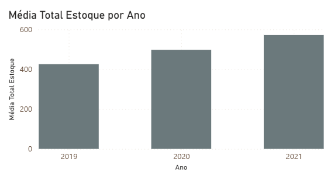
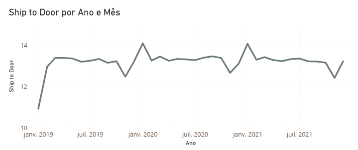
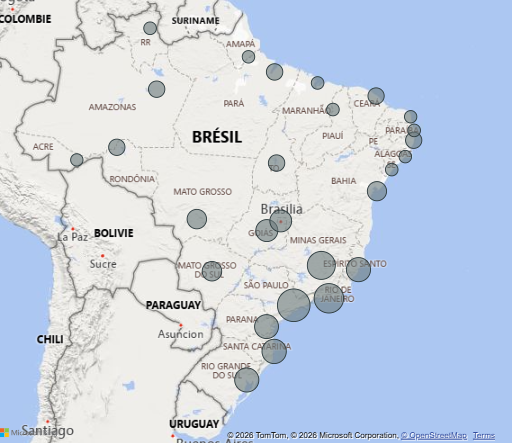
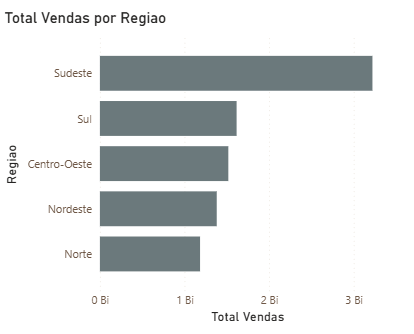
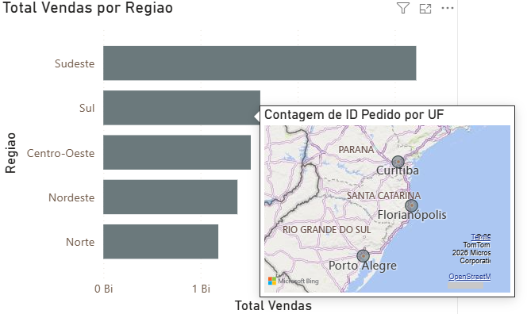

# Strategic Data Visualization & Business Analytics Notes

## Course Overview: Practicing Power BI: Creating Strategic Visualizations to Answer Business Questions

This repository stores notes, layout documentation, and technical breakdowns for the third stage of the Power BI development cycle. Moving forward from data modeling and DAX implementation, this phase focuses on **Data Visualization (DataViz)** and UI/UX best practices—transforming raw metrics into high-impact, interactive dashboards that answer critical operational and financial questions for Hermex.

---

## Visual Layer & Time-Series Exploration

### 1. Time-Series Granularity & Stock Analytics (Column Charts & Hierarchies)

#### Objective
The operational directors at Hermex need to monitor inventory fluctuations over time to identify seasonal patterns and optimize product replenishment cycles. The goal is to build an interactive, high-level Column Chart displaying the average stock levels by year, while enabling users to navigate through different time granularities dynamically.

#### Step-by-Step Implementation

1. In the **Report View** (Exibição de Relatório), select the **Clustered Column Chart** (Gráfico de colunas agrupadas) from the Visualizations pane.
2. Configure the visual fields as follows:
   * **X-Axis (Eixo X):** Drag the `Data atualizacao` column from the `Dim_Estoque` table. Ensure it is configured as a **Date Hierarchy** (Hierarquia de datas: *Ano > Trimestre > Mês > Dia*).
   * **Y-Axis (Eixo Y):** Drag the pre-existing `[Média Total Estoque]` measure.
3. **Granularity Alignment:** Click the **Drill Up** arrow icon (the single upward-pointing arrow on the top right/left of the visual) multiple times until the chart rolls up completely to show only the aggregated data at the **Year (Ano)** level. 
4. *Alternative Approach:* If the end-user strictly requires a static view without multi-level exploration, remove the `Trimestre`, `Mês`, and `Dia` fields from the X-axis field well, leaving only `Ano`.

---

#### Technical Breakdown: Hierarchy Navigation and Chart Performance

This visualization relies on Power BI’s native time-intelligence intelligence layer to structure visual data:

* **Date Hierarchies (Hierarquias de Data):** When a date field is placed on a chart axis, Power BI automatically breaks it down into nested layers. This allows a single visual to hold multiple analytical perspectives without cluttering the canvas layout.
* **Drill Down / Drill Up Engine:** 
  * **Drill Up:** Aggregates data to a higher level of abstract logic (e.g., summing or averaging daily data points up to a single annual bar). This is essential for executive dashboards where macro-trends matter more than daily noise.
  * **Drill Down:** Pierces through the current layer to reveal deeper operational details (e.g., clicking on 2026 to see its quarters or specific months) on demand.
* **Context Interaction:** The chart responds instantly to external cross-filtering. If a user clicks on a specific product category in another chart, this stock average chart recalculates the annual means across time for that category instantly.



---

### 2. Operational Logistics Timeline (Line Charts & Custom Date Granularity)

#### Objective
The logistics management team at Hermex needs to track delivery efficiency using the **Ship to Door** metric, which monitors the average lead time between a customer placement and actual delivery. To capture performance bottlenecks and monthly seasonal trends, the goal is to build a time-series line chart configured to display data at a combined Year and Month granularity.

#### Step-by-Step Implementation

1. In the **Report View** (Exibição de Relatório), select the **Line Chart** (Gráfico de linhas) from the Visualizations pane.
2. Configure the visual fields as follows:
   * **X-Axis (Eixo X):** Drag the `Data de Entrega` column from the `Fato_Pedidos` table. 
   * **Hierarchy Adjustment:** By default, Power BI creates a full 4-level Date Hierarchy (*Ano > Trimestre > Mês > Dia*). To restrict the chart to a continuous chronological flow without daily noise, click the **"X"** icon next to `Trimestre` and `Dia` in the field well to delete them, leaving only **Ano** and **Mês**.
   * **Y-Axis (Eixo Y):** Drag the pre-existing `[Ship to Door]` measure.
3. *Alternative Data Modeling Practice:* If using a dedicated calendar table, the continuous `Ano Mês` column from `Dim_Calendario` could also map this axis to achieve identical filtering continuity.

---

#### Technical Breakdown: Continuous Time Series & Filter Propagation

Using custom hierarchies in line charts modifies how the visual engine interprets data axes:

* **Line Chart Use Case:** Unlike column charts—which excel at discrete category comparisons (like individual years)—line charts are the standard choice for continuous timelines, guiding the eye across variations, peaks, and performance drops.
* **Granularity Control:** Deleting `Trimestre` and `Dia` forces the visualization engine to flatten the time dimension to monthly buckets. Instead of forcing the user to manually click "Drill Down" to see months, the chart immediately presents a scannable chronological narrative spanning across all years.
* **Granularity Filter Context:** Every data point on the line visual represents a precise mathematical filter context. A point located on the intersection of "May 2026" isolates all underlying rows in `Fato_Pedidos` where the delivery date falls within that specific month, computing the average operational days strictly for that subset.



----

### 3. Geospatial Order Distribution (Map Visuals & Data Categorization)

#### Objective
The strategic planning and logistics teams at Hermex need to analyze the geographic distribution of orders to identify regions with the highest delivery volumes. This spatial insight is critical for allocating warehouse resources, establishing regional hubs, and optimizing freight transport routes. The goal is to build an interactive Map visual displaying order volumes by state (`UF`).

#### Step-by-Step Implementation

1. In the **Data View** (Exibição de Dados), select the `Fato_Pedidos` table, click on the `UF` column, and navigate to the **Column Tools** (Ferramentas da Coluna) tab.
2. **Data Categorization:** Locate the **Data Category** (Categoria dos Dados) dropdown and change it from *Uncategorized* to **State or Province** (Estado ou Província). This ensures the Bing Maps engine maps the geographical coordinates accurately.
3. Switch back to the **Report View** (Exibição de Relatório) and select the **Map** (Mapa) visual from the Visualizations pane.
4. Configure the visual fields as follows:
   * **Location (Localização):** Drag the categorized `UF` column from the `Fato_Pedidos` table.
   * **Bubble Size (Tamanho da Bolha):** Drag the `Quantidade` column from the `Fato_Pedidos` table and ensure its aggregation function is set to **Count** (Contagem).

---

#### Technical Breakdown: Geographic Mapping and Bubble Scaling Context

Geographical visuals execute special background queries to render spatial data layers:

* **Geocoding Meta-Data Layer:** Changing the Data Category wraps the text string (e.g., "BR-SP") into a definitive geographic entity. Without this metadata assignment, the mapping engine might experience plotting errors or fail to resolve location codes that exist in multiple countries.
* **Bubble Size Scaling (Implicit vs. Explicit Measures):** Dragging a physical column like `Quantidade` and setting it to *Count* creates an **implicit measure**. While this works perfectly for simple visual prototyping, it counts the total number of order rows per state. 
* **Cross-Filtering Power:** Map visuals act as high-impact slicers. Clicking a larger bubble (such as São Paulo or Rio de Janeiro) filters the entire report dashboard to that specific state context, allowing analysts to instantly see the historical stock levels and delivery timelines (`Ship to Door`) for that specific region alone.



---

### 4. Executive KPI Monitoring (Card Visuals & High-Level Metrics)

#### Objective
The leadership and operations teams at Hermex require a quick, high-level overview of delivery compliance to evaluate shipping efficiency at a single glance. The goal is to implement Card visuals to isolate and track the absolute volume of both delayed and on-time orders, creating an immediate health-check indicator for the entire logistics pipeline.

#### Step-by-Step Implementation

1. In the **Report View** (Exibição de Relatório), select the **Card** (Cartão) visual from the Visualizations pane.
2. Configure the first visual field as follows:
   * **Fields (Campos):** Drag the pre-existing measure `[Total pedidos atrasados]` into the field well.
3. Select another **Card** (Cartão) visual from the pane (or copy and paste the first card to preserve sizing symmetry).
4. Configure the second visual field as follows:
   * **Fields (Campos):** Drag the pre-existing measure `[Total pedidos no prazo]` into the field well.
5. **UI/UX Design Best Practice:** Ensure both cards are formatted clearly with explicit data labels, and add data callout formatting (such as proper thousands separators) to make the raw volume easily readable for stakeholders.

---

#### Technical Breakdown: The Role of Cards in Information Hierarchy

Card visuals display isolated scalar values and interact dynamically with the model architecture:

* **The Single-Value Context:** Unlike tables or charts that break metrics down across categories (like months or states), a Card visual collapses all background data into a single aggregated total based on the active **Filter Context**.
* **Zero Row Context Performance:** Because these cards utilize pre-optimized DAX measures (`COUNTROWS` combined with `FILTER`), they require no physical processing overhead on the visual canvas. The engine simply queries the virtual filtered cache and displays the resulting integer in milliseconds.
* **Dynamic Cross-Filtering Reactivity:** If an executive clicks on the "Sudeste" region bubble in a map or selects a specific year in a chart, these cards will instantly re-evaluate. The numbers will dynamically shift to show the exact balance of delayed vs. on-time orders *only* for that selected subset, transforming static cards into deep, exploratory tools.

### 5. Regional Revenue Contribution (Horizontal Bar Charts & Categorical Layouts)

#### Objective
The commercial and logistics management teams at Hermex need to analyze revenue distribution across different macro-regions to identify high-performing core markets and pinpoint expansion opportunities. The goal is to build an optimized horizontal Bar Chart displaying total sales revenue (`Total Vendas Otimizada`) mapped by geographical region (`Regiao`).

#### Step-by-Step Implementation

1. In the **Report View** (Exibição de Relatório), select the **Clustered Bar Chart** (Gráfico de barras agrupadas) from the Visualizations pane.
2. Configure the visual fields as follows:
   * **Y-Axis (Eixo Y):** Drag the calculated column `Regiao` from the `Fato_Pedidos` table.
   * **X-Axis (Eixo X):** Drag the optimized measure `[Total Vendas Otimizada]` from the `_Measures` table.
3. **UI/UX Sorting Best Practice:** Click the ellipses (**...**) on the top-right corner of the visual, select **Sort axis** (Classificar eixo), and set it to sort by `Total Vendas Otimizada` in **Descending** (Decrescente) order. This immediately places the highest-grossing market at the very top.

---

#### Technical Breakdown: Horizontal Layout Efficiency and Categorical Filtering

Choosing a horizontal bar chart over a vertical column chart alters how analytical data is absorbed:

* **UX Text Readability:** Horizontal layouts are the professional standard for non-temporal nominal categories (such as Regions or Product Categories). Because the text labels on the Y-axis read naturally from left to right, it eliminates text truncation and prevents the user from having to tilt their head to read angled labels.
* **Implicit Sorting and Pareto Focus:** Sorting the bar lengths in descending order allows executives to perform a rapid Pareto analysis within two seconds, immediately separating the primary revenue drivers (the longest bars at the top) from underperforming territories (the shorter bars at the bottom).
* **Cross-Filtering and Dynamic Highlighting:** In an interconnected canvas dashboard, selecting a specific region's bar (e.g., "Sudeste") sends a cascading filter signal throughout the model. This will instantly force the Map visual to zoom in, the KPI Cards to change their delayed order volumes, and the Line Charts to isolate delivery timelines strictly for that single region.



----

### 6. Interactive Drill-Through Layers (Custom Page Tooltips & Spatial Details)

#### Objective
To enhance dashboard interactivity and maximize canvas real estate, the analytics team at Hermex requires a progressive disclosure layout strategy. Instead of cluttering the main screen with multiple granular charts, the goal is to configure a custom **Page Tooltip** on the *Regional Revenue Contribution* bar chart. When a user hovers over a specific region's bar, a hidden, fully functional map visual must dynamically appear, isolating and displaying detailed sales breakdown by state (`UF`) strictly for that hovered territory.

#### Step-by-Step Implementation

##### Step 1: Creating and Configuring the Tooltip Canvas
1. In the Page Tab section at the bottom of Power BI Desktop, click the **"+"** icon to create a **New Page**. Right-click it and rename it to `Tooltip_Mapa_Estado`.
2. Ensure **no visual is selected** on the canvas, then navigate to the **Format Page** (Formatar página) section in the Visualizations pane.
3. Expand the **Canvas Settings** (Configurações da tela) card, open the **Type** (Tipo) dropdown, and select **Tooltip** (Dica de ferramenta). *(This immediately resizes the canvas to a compact, standard tooltip resolution).*
4. Expand the **Page Information** (Informações da página) card and toggle the **Allow use as tooltip** (Permitir uso como dica de ferramenta) switch to **On**.
5. **Visual Layout:** Inside this compact canvas, create a **Map** (Mapa) visual. Set `UF` as the Location, and add `[Total Vendas Otimizada]` to the Bubble Size. Format the map layout to look minimal and clean.

##### Step 2: Binding the Tooltip to the Main Regional Chart
1. Navigate back to the primary report dashboard page and click on the *Regional Revenue Contribution* horizontal bar chart (created in Topic 5).
2. Go to the **Format Visual** (Formatar visual) tab in the Visualizations pane and switch to the **General** (Geral) properties tab.
3. Locate the **Tooltips** (Dicas de ferramenta) toggle and ensure it is turned **On**.
4. Expand the Tooltips options card, set the **Type** to *Report Page* (Página de relatório), and select `Tooltip_Mapa_Estado` from the **Page** dropdown menu.
5. **Validation:** Hover the mouse cursor over any regional bar (e.g., "Sul"). The custom map tooltip should instantly generate inside a floating window, showing exclusively the states belonging to that region.

---

#### Technical Breakdown: Dynamic Context Pass-Through and Tooltip Architecture

Custom page tooltips leverage Power BI's automatic filter propagation across hidden canvas layers:

* **Automated Context Injection:** When a user hovers over a visual element, the specific evaluation context of that element (e.g., `Fato_Pedidos[Regiao] = "Nordeste"`) is temporarily captured by the engine. This active filter is instantaneously injected into the hidden `Tooltip_Mapa_Estado` page before rendering its visual elements.
* **Granularity Cascading:** The map visual inside the tooltip operates at the state granularity level (`UF`). Because it receives the high-level regional filter from the main chart, it calculates the geographic bubble sizes using `[Total Vendas Otimizada]` strictly for the subsets that match the active region, eliminating data noise from the rest of the country.
* **Canvas Space Optimization:** This technique drastically reduces visual cognitive load for executives. It satisfies the analytical need for granular spatial telemetry without requiring a secondary page navigation click or dedicating permanent layout blocks to sub-regional charts.



----

### 7. Dynamic Axis Disruption (Field Parameters & Multi-Dimensional Slicing)

#### Objective
To maximize analytical flexibility without multiplying the number of visuals on the canvas, the business intelligence team at Hermex requires a dynamic dimension switching mechanism. The goal is to implement a **Field Parameter** named `Categorias` that empowers end-users to toggle the categorical axis of a single vertical Column Chart between three distinct business perspectives: *Vehicle Type* (`Tipo`), *Geographic Region* (`Regiao`), and *Order Status* (`Status de Entrega`).

#### Step-by-Step Implementation

##### Step 1: Creating the Field Parameter Table
1. In the top ribbon of Power BI Desktop, navigate to the **Modeling** (Modelagem) tab.
2. Click on **New parameter** (Novo parâmetro) and select **Fields** (Campos) from the dropdown.
3. In the configuration window, set the **Name** to `Categorias`.
4. From the data fields pane on the right, drag and drop the following columns into the parameter list:
   * `Tipo` (from the `Dim_Veículos` table)
   * `Regiao` (from the `Fato_Pedidos` table)
   * `Status de Entrega` (from the `Fato_Pedidos` table)
5. Ensure the checkbox **Add slicer to this page** (Adicionar segmentador de dados a esta página) is **checked**, then click **Create** (Criar). *(This automatically generates a new calculated table in your model and drops a slicer selection box onto your current canvas).*

##### Step 2: Building the Dynamic Visual
1. Select the **Clustered Column Chart** (Gráfico de colunas agrupadas) from the Visualizations pane.
2. Configure the visual fields as follows:
   * **X-Axis (Eixo X):** Drag the newly created `Categorias` parameter table field (not the individual columns, but the parameter entity itself).
   * **Y-Axis (Eixo Y):** Drag the optimized measure `[Total Vendas Otimizada]`.
3. **Validation:** Click on the different options inside the generated slicer (`Tipo`, `Regiao`, or `Status de Entrega`). The X-axis labels and the column distributions of the chart will dynamically swap and recalculate instantly based on your selection.

---

#### Technical Breakdown: Calculated Tables and Dynamic Axis Evaluation

Field parameters operate as an abstraction layer over the storage engine, modifying how evaluation contexts are passed:

* **Behind the Scenes (DAX Table Generation):** When a Field Parameter is created, Power BI generates a native calculated table using a specialized row-constructor function that looks like this:

```dax
  Categorias = {
      ("Tipo de Veículo", NAMEOF('Dim_Veículos'[Tipo]), 0),
      ("Região", NAMEOF('Fato_Pedidos'[Regiao]), 1),
      ("Status do Pedido", NAMEOF('Fato_Pedidos'[Status de Entrega]), 2)
  }
```

The `NAMEOF` function captures the hardcoded metadata path of the column, while the trailing integer dictates the visual sort order.

* Dynamic Coordinate Mapping: When the user interacts with the slicer, the selected string modifies the structural coordinate of the chart's X-axis. The visual engine stops executing a fixed query and instead projects the `[Total Vendas Otimizada]` measure against the column referenced by the active parameter row.

* Canvas Sizing Optimization: This structural versatility eliminates the need for old-school workarounds like Bookmark switching or page duplication. It offers a clean, unified space where stakeholders can cycle through operational, commercial, and logistical metrics within a single layout block.

---

### 8. Conditional Compliance Metrics (Native KPI Visuals & Target Baselines)

#### Objective
To provide the executive board with an instant strategic evaluation of logistics performance, the goal is to implement a native **KPI** visual. This indicator will track the average **Ship to Door (S2D)** lead time across historical years, projecting the metric directly against a strict corporate operational baseline target of **15 days** (`Meta S2D`) to dynamically signal target compliance through status color-coding.

#### Step-by-Step Implementation

1. In the **Report View** (Exibição de Relatório), select the **KPI** visual from the Visualizations pane. *(It features a small icon with a green arrow and a percentage).*
2. Configure the visual fields exactly as follows:
   * **Value (Valor):** Drag the optimized measure `[Ship to Door]`.
   * **Trend axis (Eixo de tendência):** Drag the `Data de Entrega` column from the `Fato_Pedidos` table. Expand its automatic date hierarchy and keep **only** the `Ano` field, removing *Trimestre*, *Mês*, and *Dia*.
   * **Target (Destino):** Drag the pre-defined target measure `[Meta S2D]`.
3. **Format Tuning (UI/UX):** Navigate to the visual's formatting properties. Under **Color coding** (Codificação de cores), ensure that the status direction is set to **High is Good** or **Low is Good** depending on business logic. Since `Ship to Door` measures *days of delay*, a **lower value is better**. Ensure that values $\le 15$ days render as green and values $> 15$ render as red.

---

#### Technical Breakdown: The Architecture and Evaluation Engine of the KPI Visual

The native KPI visual has a unique evaluation logic that sets it apart from standard cards:

* **The Anchor Point Logic:** A KPI visual does not show an average of all years combined. Instead, it uses the **Trend Axis** to sort the timeline and automatically anchors the main display value to the **latest available chronological period** in the current filter context (e.g., the year 2026).
* **The Background Sparkline:** The faint area-chart silhouette rendered behind the main callout number represents the historical progression of `Ship to Door` across the years. This provides immediate historical context without taking up additional canvas layout blocks.
* **Dynamic Target Variance:** The visual evaluates the current year's scalar value against the `[Meta S2D]` measure. If the actual value meets the target criteria, the core metric and background sparkline are automatically painted with a compliance color (Green). If the operational lead time breaches the 15-day limit, the visual switches the status context color to alert (Red), instantly triggering an executive call to action.

---

#### Technical Breakdown: The Architecture and Evaluation Engine of the KPI Visual

The native KPI visual has a unique evaluation logic that sets it apart from standard cards:

* **The Anchor Point Logic (O Último Ano do Eixo):** O visual de KPI não calcula uma média geral de todos os anos combinados. Em vez disso, ele usa o **Trend Axis** (Eixo de tendência) para ordenar a linha do tempo e ancora o valor central exibido no **último período disponível** (o ano mais recente do contexto). Se o seu modelo possui dados de 2024, 2025 e 2026, o número grande que você vê na tela é o resultado exclusivo de 2026.
* **The Background Sparkline:** A silhueta de gráfico de área renderizada de forma suave ao fundo do número representa a progressão histórica do `Ship to Door` ao longo dos anos anteriores, dando contexto de evolução sem gastar espaço no painel.
* **Directional Color Coding (Menor é Melhor):** Por padrão, o Power BI assume que números mais altos são melhores (Verde). No entanto, para métricas de tempo de entrega, eficiência logística ou custos, **quanto menor o número, melhor o resultado**. Configurar a direção para *Low is Good* garante que, se o tempo de entrega de 2026 estiver abaixo ou igual à meta de 15 dias, o visual ficará verde. Se estourar os 15 dias, ele mudará instantaneamente para vermelho.


---

---

## Final Considerations & Project Checklist

The Hermex Logistics Dashboard project has been successfully completed, covering everything from DAX query optimization to global UI/UX best practices.

### Repository Assets
* **Hermex_Logistics.pbix**: The core Power BI report file featuring optimized measures, relationships, and custom visuals.
* **`/assets`**: Directory containing Hermex corporate logos, navigation panel icons, and the custom theme color palette.

### Technical Takeaways
* **Bilingual Matrix & DAX Transition**: Standardization of operational metrics into corporate English standards, including Sales Share, Ship to Door, and Average Total Inventory.
* **Advanced Layout & Navigation**: Implementation of a modern, streamlined vertical menu for seamless navigation between the Overview and Sales views.
* **Performance Optimization**: Fine-tuning column layout distribution and matrix formatting to ensure data density is balanced and visually professional.

