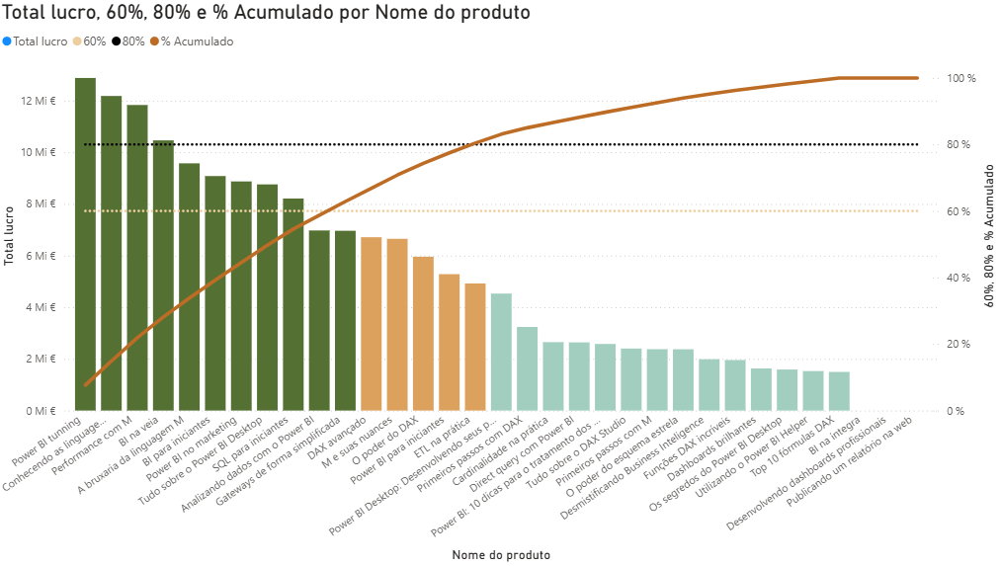

# Course 3: Power BI - Applying DAX to Business Scenarios

## 1: Project Alignment and Advanced Scope

### 1.1. Core Deliverables & Analytical Architecture
The primary objective of this project is to transition from basic row/filter context manipulation into advanced business intelligence frameworks using dynamic DAX expressions.

* **Key Deliverables Matrix:**
  | Analytical Framework | Business Value | Core DAX Mechanics |
  | :--- | :--- | :--- |
  | **ABC / Pareto Analysis** | Classification of revenue drivers (80/20 rule) to optimize inventory/investments. | Virtual tables (`SUMX`), dynamic ranking, and running totals. |
  | **Moving Averages & Totals** | Smoothing out seasonality to identify true macro-economic trends over time. | Time Intelligence modification and window functions. |
  | **Scenario Analysis (What-If)** | Simulating economic shocks, price elasticity, or marketing campaign impacts. | Parameter harvesting via disconnected tables. |

* **Architectural Strategy:** All business logic will be solved dynamically inside the DAX engine using optimized measures, completely avoiding hardcoded columns to maintain data compression and memory performance.

### 2: Time Intelligence and Trend Smoothing

### 2.1. Moving Totals & Volatility Reduction
When handling daily sales data, variance often introduces noise (spikes and drops) that masks the actual business trajectory. Implementing a dynamic moving window allows the model to smooth out these fluctuations for cleaner trend line comparison.

* **Variables (`VAR / RETURN`):** Instantiating `MAX(Tb_Calendario[Date])` inside a variable captures the specific date coordinate currently being evaluated by the chart axis. This preserves the current date context before recalculating the timeline.
* **The `DATESBETWEEN` Engine:** This function builds a customized data table on the fly. It accepts a date column, a dynamic starting boundary ($CurrentDate - 30$ days), and a dynamic ending boundary ($CurrentDate$), forcing `CALCULATE` to sum data inside this shifting 31-day window.

* **Production Code (Rolling 30-Day Totals and Last Year Comparison):**

```dax  
  total movel 30 dias = 
  VAR DataAtual = MAX(Tb_Calendario[Date])
  RETURN
  CALCULATE(
      [Total Vendas],
      DATESBETWEEN(
          Tb_Calendario[Date],
          DataAtual - 30,
          DataAtual
      )
  )

  total movel 30 dias LY = 
  VAR DataAtual = MAX(Tb_Calendario[Date])
  RETURN
  CALCULATE(
      [Total Vendas Ano Anterior],
      DATESBETWEEN(
          Tb_Calendario[Date],
          DataAtual - 30,
          DataAtual
      )
  )
```

### 2.2. Moving Averages & Iteration Engines (`AVERAGEX`)
While a Moving Total shows the absolute accumulated volume, a Moving Average divides that volume by the temporal window size to calculate the standardized daily performance. This normalizes comparisons across months with different lengths (e.g., February vs. March).

* **The Iteration Architecture (`AVERAGEX`):** Unlike standard aggregation functions, `AVERAGEX` is an iterator. It takes an temporary table as its first argument (generated dynamically by `DATESBETWEEN`) and loops through it day by day, evaluating the measure (second argument) for each row before calculating the final arithmetic mean.

* **Production Code (Rolling 30-Day Averages and Last Year Comparison):**

```dax
  media movel 30 dias = 
  VAR DataAtual = MAX(Tb_Calendario[Date])
  RETURN
  AVERAGEX(
      DATESBETWEEN(
          Tb_Calendario[Date],
          DataAtual - 30,
          DataAtual
      ),
      [Total Vendas]
  )

  media movel 30 dias LY = 
  VAR DataAtual = MAX(Tb_Calendario[Date])
  RETURN
  AVERAGEX(
      DATESBETWEEN(
          Tb_Calendario[Date],
          DataAtual - 30,
          DataAtual
      ),
      [Total Vendas Ano Anterior]
  )
```

### 2.3. Context Filtering & Row Context Validation (`COUNTROWS`)
When utilizing time intelligence over a continuous calendar table, the engine may evaluate periods where no underlying transactional data exists (e.g., displaying blank or repeated values at the boundaries of the historical data). To prevent visual distortion and enforce strict alignment with active sales periods, a logical short-circuit pattern using `IF` and `COUNTROWS` must be implemented.

* **The Validation Guard Pattern:** By nesting the core calculation inside an `IF(COUNTROWS(Fact_Table) > 0, ...)` statement, the DAX engine evaluates the rolling window only for dates containing actual transaction history. If no rows exist in the fact table for that context, it returns a blank, cleaning up charts and tables dynamically.

* **Production Code (Protected Measures):**

```dax
total movel 30 dias = 
VAR DataAtual = MAX(Tb_Calendario[Date])
RETURN
IF(
    COUNTROWS(Tb_ItensNotas) > 0,
    CALCULATE(
        [Total Vendas],
        DATESBETWEEN(
            Tb_Calendario[Date],
            DataAtual - 30,
            DataAtual
        )
    )
)

media movel 30 dias = 
VAR DataAtual = MAX(Tb_Calendario[Date])
RETURN
IF(
    COUNTROWS(Tb_ItensNotas) > 0,
    AVERAGEX(
        DATESBETWEEN(
            Tb_Calendario[Date],
            DataAtual - 30,
            DataAtual
        ),
        [Total Vendas]
    )
)
```

### 2.4. Performance Optimization via Short-Circuiting (`Performance Analyzer`)
Adding a logical validation before executing complex time intelligence calculations does not just clean up the visual aspect of the report; it radically optimizes query performance. 

When displaying continuous dates in a table or visual, the DAX engine naturally attempts to calculate the rolling measures for every single calendar row, even if no underlying transaction data exists for that specific period (generating repetitive or blank rows).

* **The Performance Bottleneck:** Without a validation guard, filtering a specific year forces the engine to iterate over thousands of empty rows from adjacent years, drastically increasing the **DAX Query** time inside the **Performance Analyzer**.
* **The Short-Circuit Solution:** By using `IF(COUNTROWS(Fact_Table) > 0, ...)`, the engine performs a lightweight count first. If the count is zero, it immediately skips the expensive `AVERAGEX` or `CALCULATE` logic (short-circuiting).
* **Benchmark Results:** In production scenarios, filtering out these empty context evaluations can reduce the DAX Query execution time from **897 ms to 26 ms** — a **97% increase in performance**, ensuring instantaneous dashboard interactions.

## 3: Scenario Analysis

### 3.1. Dynamic What-If Parameters (Numeric Range)
To deliver advanced analytical flexibility to stakeholders, hardcoded temporal windows (such as a fixed 30-day period) can be replaced by dynamic values using Power BI's **Numeric Range Parameters**. This generates a disconnected configuration table with a slicer, exposing a selectable measure (e.g., `[Período Valor]`) to inject directly into DAX calculations.

* **Mathematical Smoothness vs. Granularity:** Adjusting the moving average window alters the analytical abstraction. A smaller numeric parameter preserves local variance (micro-trends), while a higher numeric parameter flattens variance to expose structural directional movements (macro-trends).

* **Production Code (Dynamic Rolling Measures via Parameter Injection):**

```dax
media movel = 
VAR DataAtual = MAX(Tb_Calendario[Date])
VAR JanelaDias = [Período Valor]
RETURN
IF(
    COUNTROWS(Tb_ItensNotas) > 0,
    AVERAGEX(
        DATESBETWEEN(
            Tb_Calendario[Date],
            DataAtual - JanelaDias,
            DataAtual
        ),
        [Total Vendas]
    )
)

media movel LY = 
VAR DataAtual = MAX(Tb_Calendario[Date])
VAR JanelaDias = [Período Valor]
RETURN
IF(
    COUNTROWS(Tb_ItensNotas) > 0,
    AVERAGEX(
        DATESBETWEEN(
            Tb_Calendario[Date],
            DataAtual - JanelaDias,
            DataAtual
        ),
        [Total Vendas]
    )
)
```

### 3.2. Predictive "What-If" Scenarios (Price Elasticity & Demand Simulation)
To evaluate the business impact of pricing strategies against volume elasticity, we can build cross-functional simulation engines. By creating two independent numeric range parameters (`Preço produto` and `Quantidade` ranging from -100% to +100%), management can dynamically simulate trade-offs between profit margin compression and demand spikes.

* **Row-by-Row Evaluation with Cross-Table Logic (`SUMX` + `RELATED`):** Since quantity sits in the fact table (`Tb_ItensNotas`) and unit price sits in the dimension table (`Tb_Produtos`), the engine utilizes `SUMX` to iterate through transactions, pulling the related dimension attributes via `RELATED()` and compounding them with the selected parameter values.

* **Production Code (Complete Scenario Simulation Suite):**

```dax
    Total vendas cenario = 
    SUMX(
        Tb_ItensNotas, 
        [Quantidade] * (1 + [Quantidade valor]) *
        RELATED(Tb_Produtos[Preço]) * (1 + [Preço produto valor])
    )

    Total custo cenario = 
    // Challenge Accepted: Simulating cost baseline aligned with the new dynamic quantity
    SUMX(
        Tb_ItensNotas,
        [Quantidade] * (1 + [Quantidade valor]) *
        RELATED(Tb_Produtos[Custo Unitário]) 
    )

    Total lucro cenario = 
    [Total vendas cenario] - [Total custo cenario]
```

### 3.3. Dynamic Field Parameters (Metric Switching Optimization)
To avoid dashboard clutter, visual redundancy, or complex bookmark maintenance, Power BI's **Field Parameters** allow users to dynamically change the measures evaluated inside a single visual. Instead of building separate charts or pages for sales, costs, and profits, a single visual updates its context instantly based on user selection.

* **UX and Architecture Impact:** This technique dramatically reduces the number of visual elements rendered per page. Fewer visuals translate to fewer background queries hitting the Analysis Services engine concurrently, which heavily optimizes page load time.
* **Implementation Mechanism:** The parameter creates a calculated table using the `NAMEOF()` function to point dynamically to existing explicit measures. To make a chart dynamic, the hardcoded measure in the values/axis bucket (e.g., *Eixo X*) must be replaced by the generated **Field Parameter Column**.

## 4: Advanced Segmentation and Business Intelligence Frameworks

### 4.1. ABC Analysis Framework (Pareto Principle 80/20)
ABC Analysis is an inventory and sales categorization technique derived from the **Pareto Principle (80/20 Rule)**, which states that roughly 80% of consequences come from 20% of causes. In a Business Intelligence context, this framework isolates critical drivers of profitability from operational noise.

* **Risk Mitigation & Health Check:** If 80% of revenue is concentrated in a tiny fraction of products or clients (e.g., 5%), the business faces high volatility risks (concentration risk). Striving for a balanced Pareto distribution ensures portfolio health.
* **The Strategic Tiers:**
    * **Category A (High Relevance):** Top-performing items generating ~80% of cumulative value (requires tight controls).
    * **Category B (Medium Relevance):** Intermediate items generating ~15% of cumulative value.
    * **Category C (Low Relevance):** Low-margin or low-volume items generating the remaining ~5% of cumulative value.

### 4.2. Dynamic Pareto Accumulation & ABC Classification Engine
To implement a production-ready ABC classification framework, the DAX engine must perform dynamic row-by-row virtualization to compute rolling accumulated values based on a shifting profitability rank. 

* **The TOPN Dynamic Context Trick:** Instead of static iterations, the calculation combines `CALCULATE` with `TOPN`. By feeding the current row's `[Rank Lucro]` into `TOPN`, the engine creates a dynamic nested virtual table containing *only the top N rows up to that point*, summing their values to output a flawless running total.

* **Production Code (The ABC Blueprint Measures):**

```dax
Rank Lucro = 
RANKX(
    ALLSELECTED(Tb_Produtos),
    [Total Lucro]
)

Acumulado = 
CALCULATE(
    [Total Lucro],
    TOPN(
        [Rank Lucro],
        ALLSELECTED(Tb_Produtos),
        [Total Lucro],
        DESC
    )
)

% Acumulado = 
DIVIDE(
    [Acumulado],
    SUMX(
        ALLSELECTED(Tb_Produtos),
        [Total Lucro]
    )
)

Analise ABC = 
SWITCH(
    TRUE(),
    [% Acumulado] <= 0.60, "Produto A",
    [% Acumulado] <= 0.80, "Produto B",
    "Produto C"
)
```

### 4.3. Data Visualization: The Dynamic Pareto & Reference Lines Chart
To translate the DAX ABC framework into an executive-level dashboard, we implement a **Line and Stacked Column Chart**. This composite visual maps absolute profitability against its cumulative weight while establishing hard visual boundaries for action.

* **Static Threshold Measures as Reference Lines:** By creating single-value measures (`60% = 0.6` and `80% = 0.8`) and plotting them on the secondary Y-axis (Line Y-axis) along with the `% Acumulado`, we force the chart to render fixed horizontal thresholds. This segments the visual field into clear strategic zones.
* **Contextual Tooltips & Conditional Aesthetics:** Injecting the `Analise ABC` measure into the *Tooltip* bucket enables immediate on-hover categorization. Furthermore, applying the conditional formatting rules (`>= 0` to `< 0.6` as Dark Blue, `>= 0.6` to `< 0.8` as Blue, and `>= 0.8` to `< 1` as Light Blue) dynamically paints the bars based on their Pareto tier.



## Module 4: Advanced Segmentation and Business Intelligence Frameworks

### 4.4. Virtual Relationships via Disconnected Segmentation Tables (Dynamic Top-N Tiers)
When business requirements demand grouping entities into dynamic operational macro-buckets (e.g., *Top 5*, *Top 6-10*, *Outros*) that do not natively exist in the relational schema, we implement a **Disconnected Table Pattern**. This bypasses physical relationships by enforcing evaluation filters directly inside the DAX engine.

* **The Segment Boundaries Pattern:** A static configuration table (`TopN produtos`) is injected with boundary markers (`Min` and `Max` integer ranks). The main measure uses local variables (`VAR`) to harvest these context boundaries row-by-row, passing them into an iterated `FILTER` block that intercepts the product table.

* **Production Code (Dynamic Ranking and Virtual Intersect):**

```dax
    Rank Lucro = 
    RANKX(
        ALL(Tb_Produtos), // Enforces absolute historical rank across all contexts
        [Total Lucro]
    )

    TopN lucro = 
    VAR limiteMin = MIN('TopN produtos'[Min])
    VAR limiteMax = MAX('TopN produtos'[Max])
    RETURN
    CALCULATE(
        [Total Lucro],
        FILTER(
            Tb_Produtos,
            [Rank Lucro] >= limiteMin &&
            [Rank Lucro] <= limiteMax
        )
    )
```

### 4.5. Portfolio Concentration: Visualizing Top-N Aggregations (`Treemap` & `Scatter Chart`)
To effectively communicate client/product concentration risks to stakeholders, data must be structured into high-impact visuals that emphasize structural discrepancies in revenue distribution.

* **Treemap for Proportional Impact:** Implementing a Treemap using the dynamic `TopN` group column allows executives to evaluate the macro-share of each tier at a single glance. If the "Top 5" block dominates more than half of the visual real estate, it signals a high portfolio concentration risk.
* **Scatter Chart for Distribution Categorization:** Mapping individual products on the X-axis against their dynamic performance on the Y-axis, while using the `TopN` classification as the *Legend*, applies a clear color-coded clustering effect. This isolates hyper-performing products from the operational "long tail".

#### 🛠️ Resolving the Ordering Challenge (Calculated Column Sort)
By default, the engine sorts categorical text descriptions (like "Top 5", "Top 10", "Outros") alphabetically, which breaks analytical flow. To fix this, a supporting index column must be injected into the underlying dynamic table code:

```dax
// Conceptual fix for the sorting table challenge
TopN_Table = {
    ("Top 5", 1),
    ("Top 10", 2),
    ("Outros", 3)
}
```

The Solution: Select the TopN column in the Data/Model view, go to the Column Tools tab, click Sort by Column (Classificar por coluna), and choose the corresponding numeric Index/Order column. This forces the charts to align chronologically.

## 5: Performance Optimization with DAX Studio

### 5.1. Introduction to DAX Studio and External Tools Integration
As data models scale in volume and complexity (handling millions of transactions), code execution efficiency becomes paramount. **DAX Studio** is the industry-standard third-party diagnostic software used to execute queries, audit semantic models, and profile DAX measure performance.

* **The VertiPaq Connection:** When launched directly from an active Power BI Desktop session via the **External Tools** tab, DAX Studio automatically establishes an internal connection to the local Analysis Services instance (the VertiPaq engine hosting the model). This exposes the entire metadata schema, internal tables, and explicit measures instantly without manual server configuration.
* **Core Benefits for Production Environments:**
    * **Query Benchmarking:** Evaluates exact query execution times in milliseconds.
    * **Server Timings Audit:** Splits performance metrics between the Formula Engine (FE) and the Storage Engine (SE) to isolate structural bottlenecks.
    * **Cache Clearing:** Clears the active engine cache to guarantee unbiased, cold-run benchmark testing.

### 5.3. Query Profiling: Diagnosing `CallbackDataID` and Engine Optimization
To optimize DAX architecture, a developer must balance workloads between the **Formula Engine (FE)** and the **Storage Engine (SE)**, avoiding processing bottlenecks by ensuring the SE does the heavy lifting.

* **The Workload Split:**
    * **Formula Engine (FE):** Handles complex logic, scalar values, and top-level query routing. Single-threaded (utilizes only 1 CPU core).
    * **Storage Engine (SE / VertiPaq):** Performs scans, joins, and aggregations directly in-memory. Highly multi-threaded.
* **The `CallbackDataID` Performance Bottleneck:** This indicator appears in the *Server Timings* trace when the Storage Engine encounters a row-level context it cannot natively compute (such as injecting an explicit measure inside a row-by-row `IF` condition within a `SUMX` iterator). The SE is forced to drop back to the single-threaded FE for every single iteration, severely inflating query duration.
* **Optimization Blueprint (Transforming Iteration into Set-Based Filters):**

    ```dax
    // Inefficient Approach (Triggers CallbackDataID - 305 ms)
    EVALUATE
    ROW(
        "teste",
        SUMX(
            Tb_ItensNotas,
            IF(Tb_ItensNotas[Quantidade] > 20, [Total Vendas] * 1.3, [Total Vendas] * 0.5)
        )
    )

    // Optimized Approach (Pure Storage Engine Execution - 7 ms)
    EVALUATE
    ROW(
        "teste",
        CALCULATE([Total Vendas] * 1.3, Tb_ItensNotas[Quantidade] > 20)
        + 
        CALCULATE([Total Vendas] * 0.5, NOT(Tb_ItensNotas[Quantidade] > 20))
    )
    ```
* **Best Practice:** Always clear the engine cache using the **Clear Cache** utility before running a benchmark query. This guarantees a cold run, eliminating false speed readings caused by cached memory artifacts.

